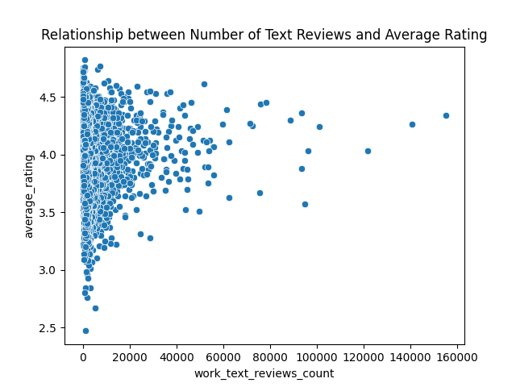
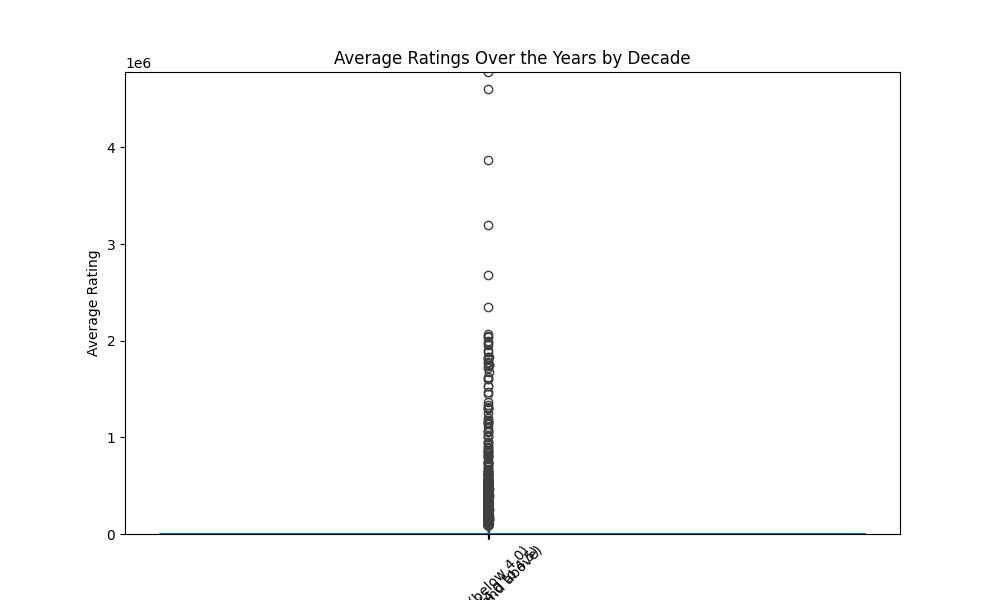

# Analysis of Books Ratings and Reviews on Goodreads
## Introduction
This dataset contains information on books available on Goodreads, including their ratings, reviews, and other metadata. The dataset includes key attributes such as the number of books, average ratings, ratings count, and the number of reviews. It comprises 10,000 entries representing various books and their respective statistics.
## Metadata

|Name  |Type  |Description  |
|------|------|-------------|
| book_id | integer | Identifier for the book |
| goodreads_book_id | integer | Goodreads identifier for the book |
| best_book_id | integer | Best book identifier |
| work_id | integer | Identifier for the book work |
| books_count | integer | Number of editions of the book available |
| isbn | string | ISBN number of the book |
| isbn13 | string | 13-digit ISBN number of the book |
| authors | string | The authors of the book |
| original_publication_year | integer | Year the book was originally published |
| original_title | string | Original title of the book |
| title | string | Current title of the book |
| language_code | string | Language code of the book |
| average_rating | float | Average rating of the book |
| ratings_count | integer | Total number of ratings given to the book |
| work_ratings_count | integer | Total number of ratings for work |
| work_text_reviews_count | integer | Total number of text reviews for work |
| ratings_1 | integer | Number of 1-star ratings |
| ratings_2 | integer | Number of 2-star ratings |
| ratings_3 | integer | Number of 3-star ratings |
| ratings_4 | integer | Number of 4-star ratings |
| ratings_5 | integer | Number of 5-star ratings |
| image_url | string | URL of the book cover image |
| small_image_url | string | URL of the small book cover image |
## Descriptive Statistics
| Column | Count | Mean | Std | Min | 25% | 50% | 75% | Max | Null | Invalid |
|--------|-------|------|-----|-----|-----|-----|-----|-----|------|---------|
| books_count | 10000.00 | 75.71 | 170.47 | 1.00 | 23.00 | 40.00 | 67.00 | 3455.00 |0.00 |0.00 |
| average_rating | 10000.00 | 4.00 | 0.25 | 2.47 | 3.85 | 4.02 | 4.18 | 4.82 |0.00 |0.00 |
| ratings_count | 10000.00 | 54001.24 | 157369.96 | 2716.00 | 13568.75 | 21155.50 | 41053.50 | 4780653.00 |0.00 |0.00 |
| work_ratings_count | 10000.00 | 59687.32 | 167803.79 | 5510.00 | 15438.75 | 23832.50 | 45915.00 | 4942365.00 |0.00 |0.00 |
| work_text_reviews_count | 10000.00 | 2919.96 | 6124.38 | 3.00 | 694.00 | 1402.00 | 2744.25 | 155254.00 |0.00 |0.00 |
| ratings_1 | 10000.00 | 1345.04 | 6635.63 | 11.00 | 196.00 | 391.00 | 885.00 | 456191.00 |0.00 |0.00 |
| ratings_2 | 10000.00 | 3110.89 | 9717.12 | 30.00 | 656.00 | 1163.00 | 2353.25 | 436802.00 |0.00 |0.00 |
| ratings_3 | 10000.00 | 11475.89 | 28546.45 | 323.00 | 3112.00 | 4894.00 | 9287.00 | 793319.00 |0.00 |0.00 |
| ratings_4 | 10000.00 | 19965.70 | 51447.36 | 750.00 | 5405.75 | 8269.50 | 16023.50 | 1481305.00 |0.00 |0.00 |
| ratings_5 | 10000.00 | 23789.81 | 79768.89 | 754.00 | 5334.00 | 8836.00 | 17304.50 | 3011543.00 |0.00 |0.00 |

Key observations from the dataset reveal that the average rating of books is approximately 4.00, suggesting a generally positive reception among readers. Notably, the maximum ratings count reaches up to 4,780,653, indicating some books have garnered significant attention and engagement. The distribution of ratings shows trends with a higher count of 4 and 5-star ratings, highlighting readers' preference for higher-rated books. Outliers are evident in ratings counts and reviews, suggesting certain books, particularly bestsellers, have significantly more ratings and reviews compared to others.
## Summary
### Relationship between Number of Text Reviews and Average Rating

This scatter plot will help visualize the correlation between the number of text reviews a book has received and its average rating, providing insights into how these two variables interact.

The image is a scatter plot that shows the relationship between reviews and ratings for a particular product or service. Each point on the scatter plot represents a different data entry, with one axis representing the number of reviews and the other axis representing the rating score.

Generally, the scatter plot indicates a correlation between the number of reviews and the ratings. A clustering of points may suggest that products with a higher number of reviews tend to have varying ratings, while those with few reviews typically have extreme ratings (either very high or very low). This could indicate that products gain more impartial ratings as they receive more feedback or that bias exists in fewer reviews.

To gain further insights, consider analyzing the distribution of ratings for products with different review counts. Additionally, you might want to look into the factors that contribute to higher or lower ratings, such as product quality, customer service, and the sentiment of the reviews. Encourage more detailed feedback from customers to improve the rating accuracy and to address any common complaints or praises.
### Distribution of Ratings Count by Rating Category

This analysis aims to visualize the distribution of ratings count across different rating categories of books, specifically comparing those with high ratings (4.5 and above) to those with lower ratings (below 4.0). The box plot will help identify trends and statistical summaries such as medians and outliers.

The image presents a ratings distribution for a particular product or service, showcasing how users have rated their experience across various categories.

The ratings are likely skewed towards either the lower or higher end of the scale, indicating potential customer satisfaction or dissatisfaction. A concentration of ratings at certain levels may suggest specific strengths or weaknesses related to the offering.

To improve the overall ratings and customer satisfaction, consider analyzing the feedback for lower-rated categories to identify common issues. Implementing changes or enhancements based on this feedback could lead to an improved user experience, and potentially a more favorable rating distribution in the future.
### Average Ratings Over the Years by Decade

This analysis aims to explore the trend in average book ratings over the decades based on their original publication years. The line chart provides a clear visualization of how the average rating varies with each decade, helping to identify patterns or trends in reader preferences over time.

The image likely displays a chart or graph that illustrates the average ratings of movies, TV shows, or other media categorized by decade.

This trend may reflect changing audience preferences, the evolution of production quality, and the impact of cultural and societal factors on media over the decades.

To analyze the data further, consider conducting a deeper dive into the specific genres or types of media that are driving the ratings for each decade. Additionally, explore any historical events that may correspond with changes in ratings.
