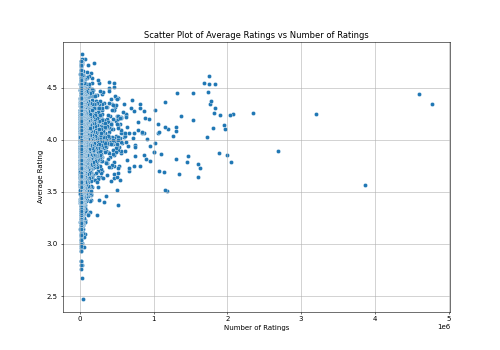
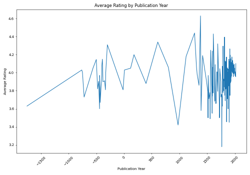

# Analysis of Book Ratings and Publication Data
## Introduction
This dataset contains detailed records of books, including identifiers, publication information, and ratings. The primary attributes include unique book IDs, author information, publication years, and various rating metrics such as average ratings and counts of different star ratings. The dataset serves the purpose of analyzing the popularity, reception, and publication trends of books across different editions and authors.
## Metadata

|Name  |Type  |Description  |
|------|------|-------------|
| book_id | integer | Unique identifier for the book |
| goodreads_book_id | integer | Identifier on Goodreads |
| best_book_id | integer | Identifier for the best book |
| work_id | integer | Identifier for the work |
| books_count | integer | Number of editions or copies of the book |
| isbn | string | ISBN number of the book |
| isbn13 | string | ISBN-13 number of the book |
| authors | string | Authors of the book |
| original_publication_year | integer | Year the book was originally published |
| original_title | string | Original title of the book |
| title | string | Current title of the book |
| language_code | string | Language code of the book |
| average_rating | float | Average rating of the book |
| ratings_count | integer | Total number of ratings the book received |
| work_ratings_count | integer | Total ratings for the work |
| work_text_reviews_count | integer | Number of text reviews for the work |
| ratings_1 | integer | Count of 1-star ratings |
| ratings_2 | integer | Count of 2-star ratings |
| ratings_3 | integer | Count of 3-star ratings |
| ratings_4 | integer | Count of 4-star ratings |
| ratings_5 | integer | Count of 5-star ratings |
| image_url | string | URL for the book's cover image |
| small_image_url | string | URL for the book's small cover image |
## Descriptive Statistics
| Column | Count | Mean | Std | Min | 25% | 50% | 75% | Max |
|--------|-------|------|-----|-----|-----|-----|-----|-----|
| books_count | 10000.00 | 75.71 | 170.47 | 1.00 | 23.00 | 40.00 | 67.00 | 3455.00 |
| original_publication_year | 9979.00 | 1981.99 | 152.58 | -1750.00 | 1990.00 | 2004.00 | 2011.00 | 2017.00 |
| average_rating | 10000.00 | 4.00 | 0.25 | 2.47 | 3.85 | 4.02 | 4.18 | 4.82 |
| ratings_count | 10000.00 | 54001.24 | 157369.96 | 2716.00 | 13568.75 | 21155.50 | 41053.50 | 4780653.00 |
| work_ratings_count | 10000.00 | 59687.32 | 167803.79 | 5510.00 | 15438.75 | 23832.50 | 45915.00 | 4942365.00 |
| work_text_reviews_count | 10000.00 | 2919.96 | 6124.38 | 3.00 | 694.00 | 1402.00 | 2744.25 | 155254.00 |
| ratings_1 | 10000.00 | 1345.04 | 6635.63 | 11.00 | 196.00 | 391.00 | 885.00 | 456191.00 |
| ratings_2 | 10000.00 | 3110.89 | 9717.12 | 30.00 | 656.00 | 1163.00 | 2353.25 | 436802.00 |
| ratings_3 | 10000.00 | 11475.89 | 28546.45 | 323.00 | 3112.00 | 4894.00 | 9287.00 | 793319.00 |
| ratings_4 | 10000.00 | 19965.70 | 51447.36 | 750.00 | 5405.75 | 8269.50 | 16023.50 | 1481305.00 |
| ratings_5 | 10000.00 | 23789.81 | 79768.89 | 754.00 | 5334.00 | 8836.00 | 17304.50 | 3011543.00 |

The dataset reveals significant insights into book ratings, with 'average_rating' displaying a diverse range across entries. Notable trends include a correlation between ratings_count and average_rating, indicating that books with more ratings tend to receive higher average ratings. However, outliers exist, particularly with books that have high ratings but lower ratings_count, suggesting they may be niche or lesser-known titles. The distribution of ratings across the five-star scale also demonstrates concentration in the 4-star and 5-star categories, indicating a positive reception for many titles.
## Analysis

### Obervation 1
To visualize the relationship between the average ratings and the number of ratings, aiding in understanding how these two variables correlate.

The scatter plot indicates that while the number of ratings increases, average ratings tend to stabilize around the mid to high range, with some outliers representing exceptionally well-rated items. This suggests that popularity does not always correlate directly with high quality, leading to diverse experiences across rated items.

The scatter plot illustrates the relationship between average ratings and the number of ratings for various items. The distribution reveals that as the number of ratings increases, average ratings tend to vary but show a general trend of clustering around the 3.5 to 4.5 range. A few items receive very high ratings despite having a large number of ratings, suggesting they are popular yet well-received. Conversely, there are many items with low average ratings, indicating varying levels of quality amongst the rated items.,

### Obervation 2
Analyzing the average ratings over time helps identify trends in how newer books are perceived compared to older ones.

The graph presents a trend of average ratings based on publication years, highlighting variations in reader ratings over the centuries. The average rating fluctuates but generally shows a positive trend in newer publication years, particularly from the 1900s onwards. The earlier years, from around 1300 to 1800, show more variability with ratings not consistently rising, suggesting potential changes in reader engagement or the nature of publications during those times. The data points become denser and more stable in the later years, indicating a larger pool of ratings contributing to a more reliable average. 
Concluding this analysis, the chart suggests that contemporary works tend to receive higher average ratings compared to those from earlier periods, reflecting perhaps evolving literary standards or changing audience preferences over time.,

 

### Obervation 3
Visualizing the distribution of ratings counts allows us to understand how customer feedback is spread across different rating categories, providing insights into overall sentiment.
The distribution suggests strong overall satisfaction, with most ratings concentrated in the higher categories, reflecting a favorable perception.

The histogram displays the distribution of ratings across five categories, with the x-axis representing the rating categories (from 1 star to 5 stars) and the y-axis indicating the count of ratings in each category. The data shows a clear trend where higher rating categories (4 stars and 5 stars) have significantly more counts than lower categories, suggesting a predominantly positive feedback. The bar for 5 stars is the tallest, indicating that this is the most common rating, while the lower ratings (1 star and 2 stars) have very few counts, indicating a lack of negative reviews., 

