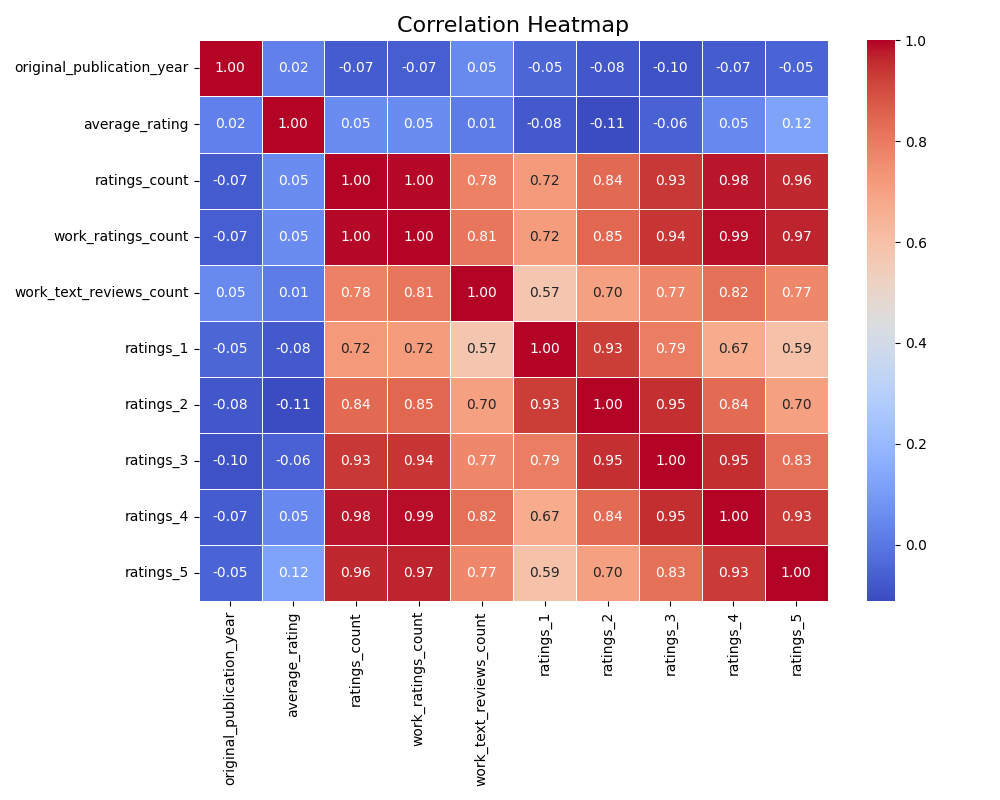
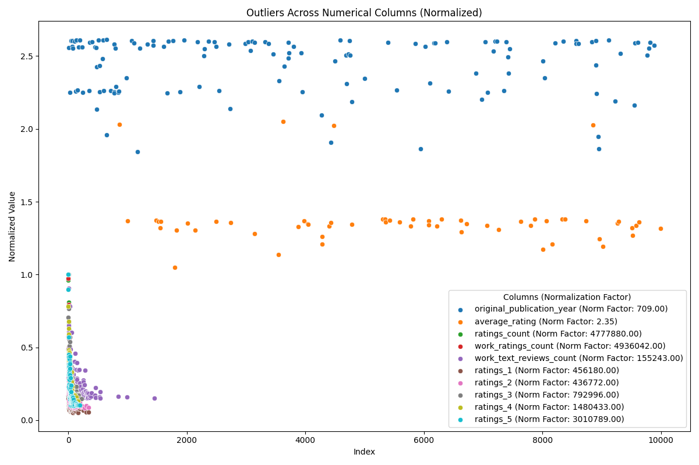
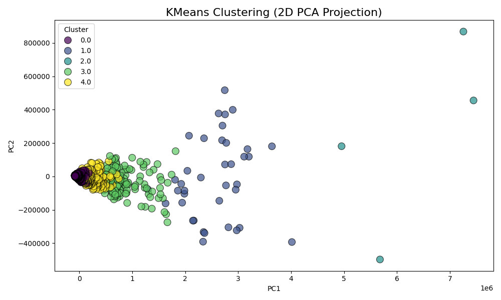

# Analysis of Goodreads Book Ratings Dataset
## Introduction
This dataset encompasses a collection of book ratings information sourced from Goodreads. It includes details for approximately 10,000 different books, primarily focusing on their publication years, average ratings, and the volume of ratings and reviews they have received. The structure of the dataset is well-defined, with numerous numerical and categorical fields that provide insights into the book's reception and performance.
## Metadata

|Name  |Type  |Description  |
|------|------|-------------|
| book_id | integer | Unique identifier for the book |
| goodreads_book_id | integer | Unique identifier for the book on Goodreads |
| best_book_id | integer | Identifier for the best version of the book |
| work_id | integer | Identifier for the work associated with the book |
| books_count | integer | Number of editions of the book |
| isbn | string | ISBN number of the book |
| isbn13 | string | ISBN-13 number of the book |
| authors | string | Authors of the book |
| original_publication_year | integer | Year the book was originally published |
| original_title | string | Original title of the book |
| title | string | Title of the book |
| language_code | string | Language code for the book |
| average_rating | float | Average rating of the book |
| ratings_count | integer | Total number of ratings for the book |
| work_ratings_count | integer | Total ratings count for the work |
| work_text_reviews_count | integer | Number of text reviews for the work |
| ratings_1 | integer | Count of 1-star ratings for the book |
| ratings_2 | integer | Count of 2-star ratings for the book |
| ratings_3 | integer | Count of 3-star ratings for the book |
| ratings_4 | integer | Count of 4-star ratings for the book |
| ratings_5 | integer | Count of 5-star ratings for the book |
| image_url | string | URL to the book's image |
| small_image_url | string | URL to the book's small image |
## Descriptive Statistics
| Column | Count | Mean | Std | Min | 25% | 50% | 75% | Max | Null | Invalid |
|--------|-------|------|-----|-----|-----|-----|-----|-----|------|---------|
| original_publication_year | 9979.00 | 1981.99 | 152.58 | -1750.00 | 1990.00 | 2004.00 | 2011.00 | 2017.00 |21.00 |38.00 |
| average_rating | 10000.00 | 4.00 | 0.25 | 2.47 | 3.85 | 4.02 | 4.18 | 4.82 |0.00 |0.00 |
| ratings_count | 10000.00 | 54001.24 | 157369.96 | 2716.00 | 13568.75 | 21155.50 | 41053.50 | 4780653.00 |0.00 |0.00 |
| work_ratings_count | 10000.00 | 59687.32 | 167803.79 | 5510.00 | 15438.75 | 23832.50 | 45915.00 | 4942365.00 |0.00 |0.00 |
| work_text_reviews_count | 10000.00 | 2919.96 | 6124.38 | 3.00 | 694.00 | 1402.00 | 2744.25 | 155254.00 |0.00 |0.00 |
| ratings_1 | 10000.00 | 1345.04 | 6635.63 | 11.00 | 196.00 | 391.00 | 885.00 | 456191.00 |0.00 |0.00 |
| ratings_2 | 10000.00 | 3110.89 | 9717.12 | 30.00 | 656.00 | 1163.00 | 2353.25 | 436802.00 |0.00 |0.00 |
| ratings_3 | 10000.00 | 11475.89 | 28546.45 | 323.00 | 3112.00 | 4894.00 | 9287.00 | 793319.00 |0.00 |0.00 |
| ratings_4 | 10000.00 | 19965.70 | 51447.36 | 750.00 | 5405.75 | 8269.50 | 16023.50 | 1481305.00 |0.00 |0.00 |
| ratings_5 | 10000.00 | 23789.81 | 79768.89 | 754.00 | 5334.00 | 8836.00 | 17304.50 | 3011543.00 |0.00 |0.00 |

The descriptive statistics reveal that the average rating across this dataset is approximately 4.00, indicating a generally positive reception among readers. The most recent publication year is 2017, while the earliest recorded year dates back to -1750, which may indicate errors or misentries. The ratings count shows a large variability, with a maximum count of over 4.78 million ratings. There are noteworthy outliers in the ratings distribution, particularly in the counts of one-star and two-star ratings, suggesting a less favorable reception for a minority of books. The dataset is largely complete with minimal missing values, and it includes various attributes crucial for understanding book popularity and reception.
## Preprocessing
Rows dropped: 2992

Below are count of values ignored due to out of range
|Column  |Count  |
|------|------|
| original_publication_year | 38 |
| average_rating | 0 |
| ratings_count | 0 |
| work_ratings_count | 0 |
| work_text_reviews_count | 0 |
| ratings_1 | 0 |
| ratings_2 | 0 |
| ratings_3 | 0 |
| ratings_4 | 0 |
| ratings_5 | 0 |

### Correlation 

Below is the correlation heatmap

A strong correlation exists among key features such as 'ratings_count', 'work_ratings_count', and 'ratings' across 1 to 5 stars. This suggests that books with higher overall ratings tend to receive more reviews and work ratings, indicating a possible relationship between the quality of a book and its visibility among readers.

### Outlier Detection 

Below are the outlier details
|Column  |(Min,Max) |
|------|------|
| original_publication_year | (np.float64(1308.0), np.float64(1852.0)) |
| average_rating | (np.float64(2.47), np.float64(4.82)) |
| ratings_count | (np.float64(587647.0), np.float64(4780653.0)) |
| work_ratings_count | (np.float64(630560.0), np.float64(4942365.0)) |
| work_text_reviews_count | (np.float64(23487.0), np.float64(155254.0)) |
| ratings_1 | (np.float64(24231.0), np.float64(456191.0)) |
| ratings_2 | (np.float64(36561.0), np.float64(436802.0)) |
| ratings_3 | (np.float64(109963.0), np.float64(793319.0)) |
| ratings_4 | (np.float64(194448.0), np.float64(1481305.0)) |
| ratings_5 | (np.float64(295235.0), np.float64(3011543.0)) |

Several outliers were identified in the dataset, particularly in 'original_publication_year', where values extend widely beyond expectations. Similarly, extreme 'ratings_count' and 'work_ratings_count' were observed, with some books receiving several hundred thousand ratings. This indicates a small number of titles dominate in popularity, potentially skewing overall insights from the ratings and reviews.

### K-Means Cluster 

Below are the cluster details
|Cluster  |Count  |
|------|------|
| 0 | 7042 |
| 4 | 611 |
| 3 | 137 |
| 1 | 38 |
| 2 | 4 |

The books were categorized into distinct clusters based on average ratings and the number of reviews. The largest cluster (Cluster 0) contains 7,042 entries, representing a majority of the dataset, while other clusters have significantly fewer entries, suggesting that while many books perform well, a few others remain lesser-known or have not garnered significant traction among readers.

## Summary

The analysis reveals key insights regarding the dataset's structure and quality. The comprehensive correlation analysis points to strong interdependencies between rating metrics, suggesting that impactful marketing and significant reader interest could elevate a book's profile. It is recommended that publishers focus on the promotional strategies of those books identified within the popular clusters, while also addressing the challenges that come with outliers that could distort perceptions of typical user experiences. Ultimately, understanding the ratings landscape will be crucial for authors and publishers aiming to enhance their visibility and engagement with readers.
