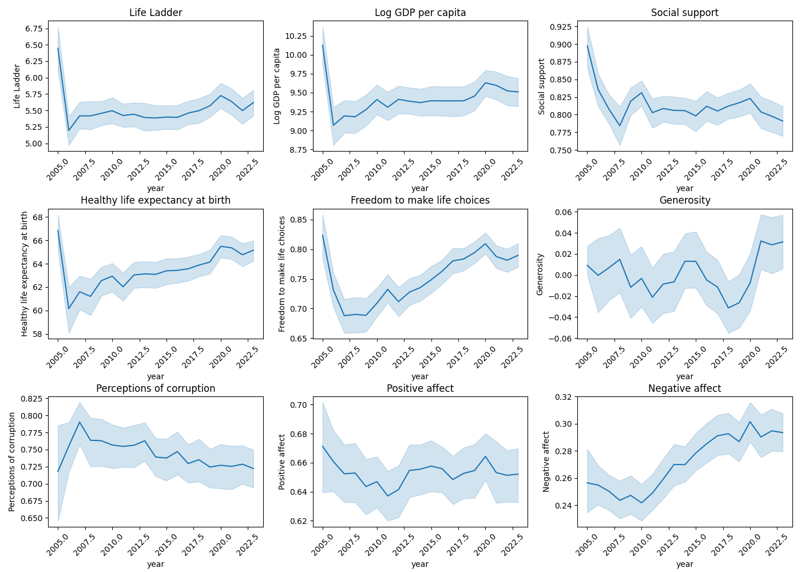
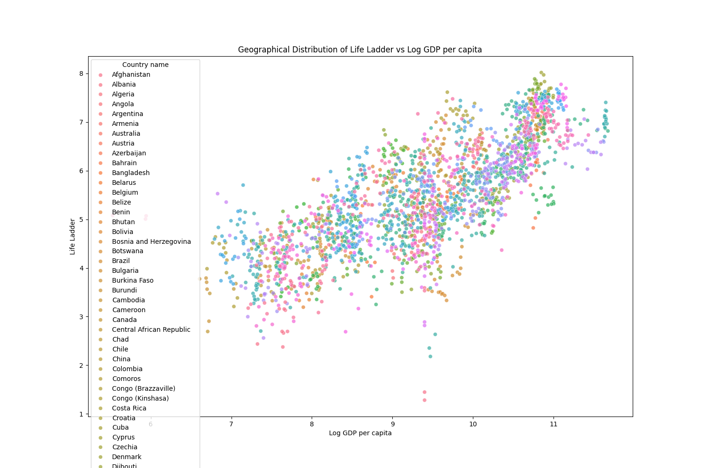
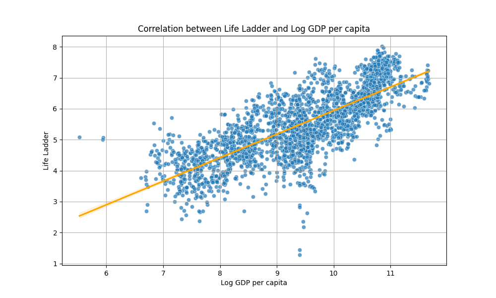
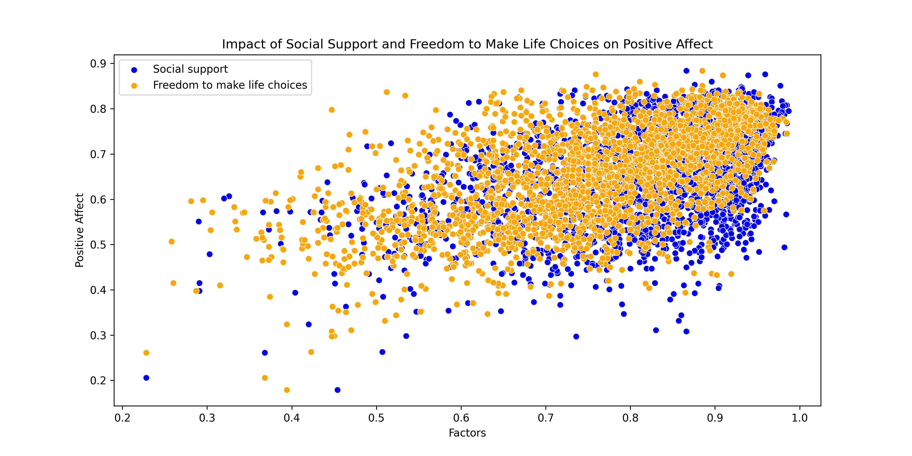

# Analysis of Global Life Well-Being Indicators
## Introduction
This dataset encompasses well-being indicators across various countries from 2005 to 2023. The indicators include aspects such as GDP per capita, social support, healthy life expectancy, and perceptions of corruption. It comprises numeric values that reflect subjective life satisfaction measures as represented through the 'Life Ladder'. Each entry provides a snapshot of different countries' circumstances regarding these facets of well-being.
## Metadata

|Name  |Type  |Description  |
|------|------|-------------|
| Country name | string | The name of the country |
| year | integer | Year of the observation |
| Life Ladder | float | A measure of subjective well-being |
| Log GDP per capita | float | Logarithm of GDP per capita |
| Social support | float | Perceived social support |
| Healthy life expectancy at birth | float | Healthy life expectancy at birth in years |
| Freedom to make life choices | float | Freedom to make life choices rating |
| Generosity | float | Generosity rating |
| Perceptions of corruption | float | Perceived levels of corruption |
| Positive affect | float | Positive affect rating |
| Negative affect | float | Negative affect rating |
## Descriptive Statistics
| Column | Count | Mean | Std | Min | 25% | 50% | 75% | Max | Null | Invalid |
|--------|-------|------|-----|-----|-----|-----|-----|-----|------|---------|
| year | 2363.00 | 2014.76 | 5.06 | 2005.00 | 2011.00 | 2015.00 | 2019.00 | 2023.00 |0.00 |218.00 |
| Life Ladder | 2363.00 | 5.48 | 1.13 | 1.28 | 4.65 | 5.45 | 6.32 | 8.02 |0.00 |0.00 |
| Log GDP per capita | 2335.00 | 9.40 | 1.15 | 5.53 | 8.51 | 9.50 | 10.39 | 11.68 |28.00 |0.00 |
| Social support | 2350.00 | 0.81 | 0.12 | 0.23 | 0.74 | 0.83 | 0.90 | 0.99 |13.00 |0.00 |
| Healthy life expectancy at birth | 2300.00 | 63.40 | 6.84 | 6.72 | 59.20 | 65.10 | 68.55 | 74.60 |63.00 |0.00 |
| Freedom to make life choices | 2327.00 | 0.75 | 0.14 | 0.23 | 0.66 | 0.77 | 0.86 | 0.98 |36.00 |0.00 |
| Generosity | 2282.00 | 0.00 | 0.16 | -0.34 | -0.11 | -0.02 | 0.09 | 0.70 |81.00 |1270.00 |
| Perceptions of corruption | 2238.00 | 0.74 | 0.18 | 0.04 | 0.69 | 0.80 | 0.87 | 0.98 |125.00 |0.00 |
| Positive affect | 2339.00 | 0.65 | 0.11 | 0.18 | 0.57 | 0.66 | 0.74 | 0.88 |24.00 |0.00 |
| Negative affect | 2347.00 | 0.27 | 0.09 | 0.08 | 0.21 | 0.26 | 0.33 | 0.70 |16.00 |0.00 |

The dataset contains 2363 records with key variables that include yearly measurements of life satisfaction, GDP, social support, life expectancy, personal freedoms, generosity, and perceptions of corruption. The mean 'Life Ladder' score is 5.48 with a noticeable minimum of 1.281, indicating disparities in life satisfaction. The highest GDP per capita recorded is 11.676 with a mean of 9.40, emphasizing economic variances among countries. There are observable trends in social support and health expectancy, where notably lower values could signify areas needing attention. Notable outliers exist in the 'Generosity' metric with maximum values reaching 0.7 against the mean of almost negligible values. The dataset shows some missing entries, particularly in the Generosity column with 81 nulls.
## Summary
### Trends Over Time for Well-Being Indicators

This analysis aims to visualize how various well-being indicators have changed over time using line plots. Trends can be observed in metrics such as Life Ladder, Social Support, and others, providing insights into societal changes.

The image likely shows various trends related to well-being, possibly including statistics on mental health, physical health, and social connections over a given period.

This trend data may reveal where people focus their well-being efforts, indicating a growing awareness of mental health or perhaps shifts in social behavior, particularly in response to recent global events.

Encourage the integration of well-being practices in workplaces and communities. Provide resources to support mental health, promote physical activity, and foster social connections to align with observed trends.
### Geographical Distribution of Life Ladder vs Log GDP per capita

This analysis visualizes the relationship between GDP per capita and life satisfaction (Life Ladder) across different countries. The scatter plot allows for assessment of how economic status (GDP) correlates with perceived well-being.

The image depicts a geographical distribution map highlighting various regions' levels of well-being, potentially using different colors or gradients to indicate varying degrees of health, prosperity, and quality of life.

The variations in well-being may reflect socio-economic factors, healthcare access, educational opportunities, and environmental conditions that differ from one region to another. Areas with higher levels of well-being may have better infrastructure, more resources, and stronger social support systems, while regions with lower well-being could be facing challenges like poverty, poor healthcare, or inadequate education.

To address the disparities shown in the map, targeted interventions should be considered, such as increasing investment in healthcare and education in lower well-being areas. Policies aimed at economic development and social support might also help balance these disparities, and further research could be conducted to identify the specific factors contributing to well-being in high and low-scoring regions.
### Correlation between Life Ladder and Log GDP per capita

This analysis aims to explore the relationship between economic development, as measured by Log GDP per capita, and subjective well-being, evaluated through the Life Ladder score across different countries.

The image likely compares two metrics: life satisfaction or happiness (represented by a life ladder) and logarithmic GDP per capita. The life ladder is a common metric used in surveys to assess subjective well-being, while log GDP indicates economic performance and wealth.

This comparison suggests a relationship between economic prosperity and individual well-being. Countries with higher log GDP may show a trend of higher life satisfaction, but the exact correlation may vary. This could indicate that while income levels contribute to life satisfaction, they may not be the sole factor influencing happiness.

Further analysis should consider additional variables such as social equality, health care quality, and cultural factors that might impact both metrics. Policymakers should focus on addressing these factors alongside economic growth to enhance overall well-being.
### Impact Analysis of Happiness Factors

This analysis visually examines the correlation between Social support, Freedom to make life choices, and Positive affect to determine which has a greater impact on individual happiness.

The image likely depicts a flowchart or diagram outlining the impact analysis process for a project or initiative, with various factors being evaluated for potential impact on stakeholders, resources, or timelines.

Impact analysis is crucial for understanding both the direct and indirect effects of changes or planned actions. It helps in identifying key stakeholders, potential risks, and areas that require mitigation or enhancement. By systematically assessing these impacts, organizations can make informed decisions that align with strategic goals.

To enhance the impact analysis process, consider the following: 1. Involve diverse stakeholders to gather varied perspectives. 2. Utilize quantitative and qualitative metrics for a comprehensive assessment. 3. Document and communicate findings effectively to ensure all team members are informed. 4. Review and update the impact analysis periodically to reflect changing circumstances or new data.
