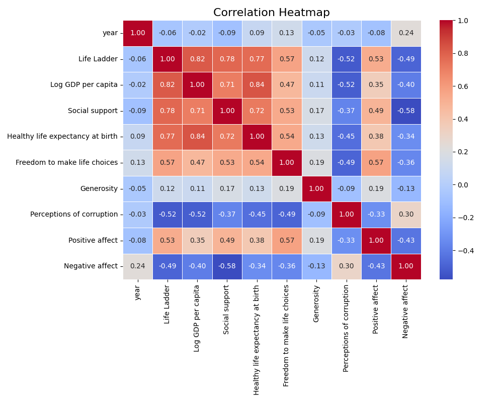
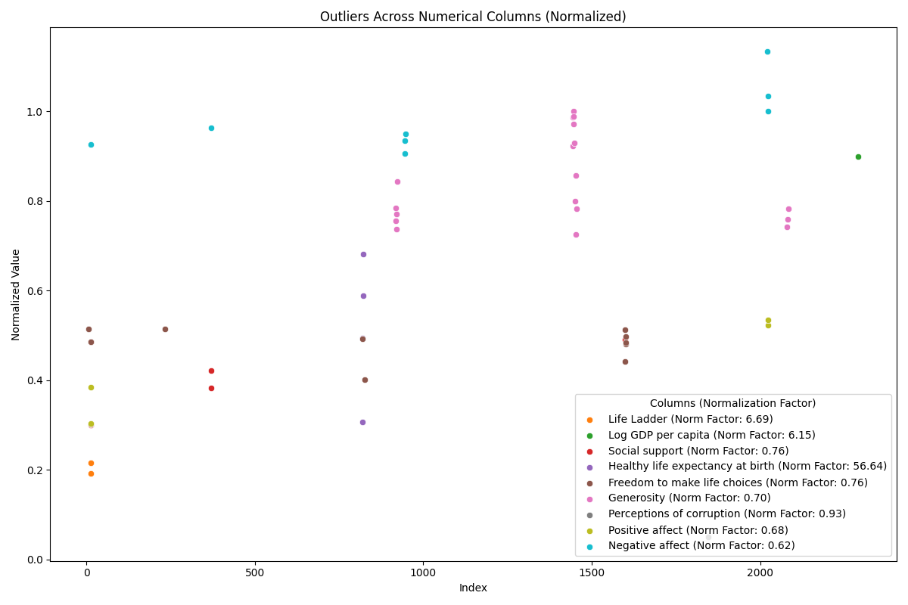
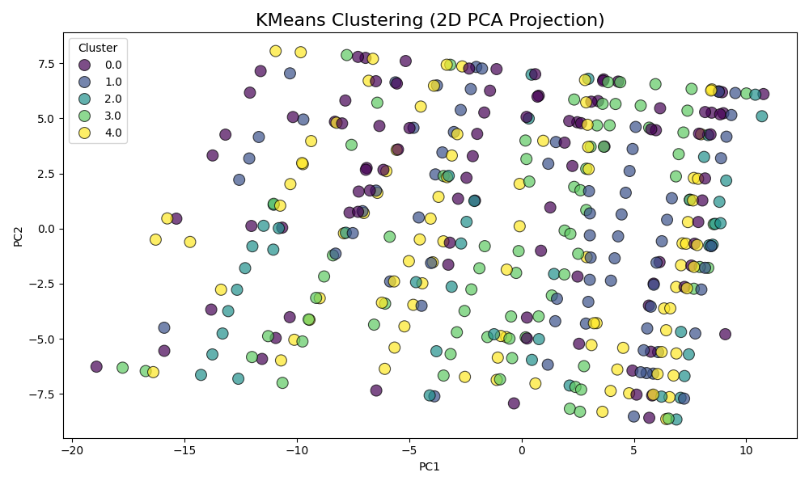
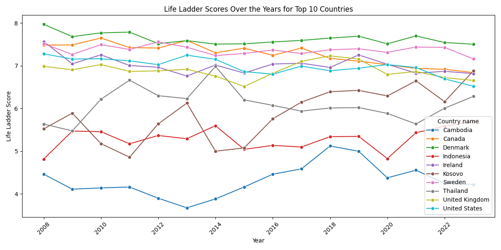

# Global Happiness and Socioeconomic Factors Analysis (2005-2023)
## Introduction
The dataset encompasses global data on life satisfaction, expressed as the 'Life Ladder', alongside various socioeconomic attributes such as Log GDP per capita, social support, and perceptions of corruption. It spans the years 2005 to 2023 and includes approximately 2363 entries for a variety of countries, facilitating a comprehensive analysis of how these factors correlate with perceived happiness levels across different nations.
## Metadata

|Name  |Type  |Description  |
|------|------|-------------|
| Country name | string | Name of the country |
| year | integer | Year of the data |
| Life Ladder | float | Measure of subjective well-being |
| Log GDP per capita | float | Logarithm of GDP per capita |
| Social support | float | Perceived social support |
| Healthy life expectancy at birth | float | Average healthy life expectancy at birth |
| Freedom to make life choices | float | Freedom to make personal choices |
| Generosity | float | Generosity score |
| Perceptions of corruption | float | Corruption perception score |
| Positive affect | float | Level of positive affect |
| Negative affect | float | Level of negative affect |
## Descriptive Statistics
| Column | Count | Mean | Std | Min | 25% | 50% | 75% | Max | Null | Invalid |
|--------|-------|------|-----|-----|-----|-----|-----|-----|------|---------|
| year | 2363.00 | 2014.76 | 5.06 | 2005.00 | 2011.00 | 2015.00 | 2019.00 | 2023.00 |0.00 |218.00 |
| Life Ladder | 2363.00 | 5.48 | 1.13 | 1.28 | 4.65 | 5.45 | 6.32 | 8.02 |0.00 |0.00 |
| Log GDP per capita | 2335.00 | 9.40 | 1.15 | 5.53 | 8.51 | 9.50 | 10.39 | 11.68 |28.00 |0.00 |
| Social support | 2350.00 | 0.81 | 0.12 | 0.23 | 0.74 | 0.83 | 0.90 | 0.99 |13.00 |0.00 |
| Healthy life expectancy at birth | 2300.00 | 63.40 | 6.84 | 6.72 | 59.20 | 65.10 | 68.55 | 74.60 |63.00 |0.00 |
| Freedom to make life choices | 2327.00 | 0.75 | 0.14 | 0.23 | 0.66 | 0.77 | 0.86 | 0.98 |36.00 |0.00 |
| Generosity | 2282.00 | 0.00 | 0.16 | -0.34 | -0.11 | -0.02 | 0.09 | 0.70 |81.00 |1270.00 |
| Perceptions of corruption | 2238.00 | 0.74 | 0.18 | 0.04 | 0.69 | 0.80 | 0.87 | 0.98 |125.00 |0.00 |
| Positive affect | 2339.00 | 0.65 | 0.11 | 0.18 | 0.57 | 0.66 | 0.74 | 0.88 |24.00 |0.00 |
| Negative affect | 2347.00 | 0.27 | 0.09 | 0.08 | 0.21 | 0.26 | 0.33 | 0.70 |16.00 |0.00 |

Key observations reveal an average Life Ladder score of approximately 5.48, indicating a moderate level of life satisfaction among the global population sampled. The Log GDP per capita shows some correlation with happiness levels, evidenced by a mean value around 9.40, yet outliers exist, including lower scores in emerging economies. Noteworthy trends include higher social support scores correlating with increased life satisfaction, while perceptions of corruption inversely relate to happiness levels. Notable anomalies include some countries with low GDP per capita but high Life Ladder scores, suggesting cultural or social factors may significantly influence happiness.
## Preprocessing
Rows dropped: 1488

Below are count of values ignored due to out of range
|Column  |Count  |
|------|------|
| year | 218 |
| Life Ladder | 0 |
| Log GDP per capita | 0 |
| Social support | 0 |
| Healthy life expectancy at birth | 0 |
| Freedom to make life choices | 0 |
| Generosity | 1270 |
| Perceptions of corruption | 0 |
| Positive affect | 0 |
| Negative affect | 0 |

### Correlation 

Below is the correlation heatmap

The correlation analysis revealed strong relationships between key features within the dataset. Notably, there was a significant positive correlation between 'Life Ladder' and 'Log GDP per capita', indicating that nations with higher log GDP tend to report greater life satisfaction. Additionally, 'Healthy life expectancy at birth' also showed a positive correlation with 'Log GDP per capita', suggesting that wealthier countries tend to have healthier populations. This highlights the interconnectedness of economic prosperity and overall well-being in nations.

### Outlier Detection 

Below are the outlier details
|Column  |(Min,Max) |
|------|------|
| year | None |
| Life Ladder | (np.float64(1.281), np.float64(1.446)) |
| Log GDP per capita | (np.float64(5.527), np.float64(5.527)) |
| Social support | (np.float64(0.228), np.float64(0.373)) |
| Healthy life expectancy at birth | (np.float64(17.36), np.float64(38.64)) |
| Freedom to make life choices | (np.float64(0.228), np.float64(0.39)) |
| Generosity | (np.float64(0.508), np.float64(0.7)) |
| Perceptions of corruption | (np.float64(0.047), np.float64(0.047)) |
| Positive affect | (np.float64(0.206), np.float64(0.363)) |
| Negative affect | (np.float64(0.564), np.float64(0.705)) |

In the examination of outliers, several features stood out prominently. Extreme values of 'Life Ladder' were observed, with an outlier range extending down to 1.281 and extending up to 1.446. Similarly, 'Log GDP per capita' also displayed a critical outlier at the lower extreme, with a minimum value of 5.527. Other features like 'Healthy life expectancy at birth' indicated an unusually wide range, with an outlier low point set at 17.36 years. Identifying these outliers is crucial as they can disproportionately affect the overall analysis and insights derived from the data.

### K-Means Cluster 

Below are the cluster details
|Cluster  |Count  |
|------|------|
| 4 | 242 |
| 0 | 206 |
| 3 | 205 |
| 1 | 204 |
| 2 | 118 |

The clustering analysis produced five distinct clusters categorized by varying sizes. Cluster 4 emerged as the largest, encompassing 242 entries, while the other clusters had slightly smaller populations: Cluster 0 with 206, Cluster 3 with 205, Cluster 1 with 204, and Cluster 2, the smallest, comprising 118 entries. This classification hints at differing levels of well-being among countries, influenced by their socio-economic features.

### Life Ladder Trends Analysis 

Below is the analysis

The life ladder analysis provides insight into how people perceive their overall life satisfaction, potentially revealing trends related to age, occupation, socio-economic status, and mental health.

To use this information constructively, consider conducting surveys to gather more data on different demographics, and implement targeted programs to support individuals at the lower rungs of the ladder, aiming to improve their overall life satisfaction.

## Summary

The overall analysis indicates a complex interplay between economic factors and societal well-being. The retained dataset, while diminished in size due to preprocessing, provides a valuable foundation for exploring how different attributes impact life satisfaction across nations. The correlation findings suggest a strong linkage between GDP and well-being, advocating for policies aimed at not only improving economic conditions but also enhancing health and social support systems. The identification of outliers beckons further investigation into the anomalies present in the dataset, which may reveal underlying social or economic phenomena. Efforts should be directed towards ensuring better data quality by managing missing values, particularly for the 'Generosity' feature. The clustering results could inform targeted interventions, tailored to distinct groups of countries based on their characteristics. Future research can leverage these insights to advocate for policies that are both economically and socially enriching.
