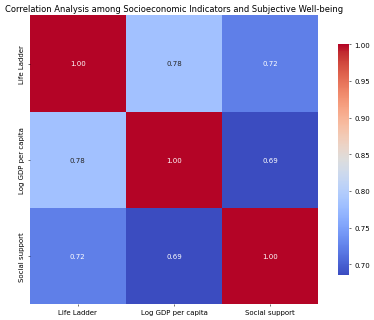
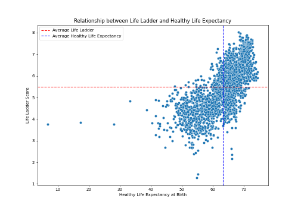
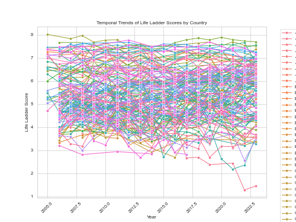

# Global Well-Being and Socioeconomic Factors Analysis
## Introduction
This dataset contains information regarding various indicators of well-being and socioeconomic conditions across different countries over a range of years starting from 2008. Key attributes include measures of subjective well-being, economic factors such as GDP per capita, social support, health metrics, and perceptions of freedom and corruption. The analysis aims to explore the interplay between these factors and their impact on global well-being.
## Metadata

|Name  |Type  |Description  |
|------|------|-------------|
| Country name | string | Name of the country |
| year | integer | Year of the data entry |
| Life Ladder | float | Subjective well-being score |
| Log GDP per capita | float | Logarithm of GDP per capita |
| Social support | float | Perceived social support |
| Healthy life expectancy at birth | float | Average life expectancy at birth |
| Freedom to make life choices | float | Perception of freedom in choices |
| Generosity | float | Level of generosity |
| Perceptions of corruption | float | Perception of corruption in society |
| Positive affect | float | Positive emotions experienced |
| Negative affect | float | Negative emotions experienced |
## Descriptive Statistics
| Column | Count | Mean | Std | Min | 25% | 50% | 75% | Max |
|--------|-------|------|-----|-----|-----|-----|-----|-----|
| year | 2363.00 | 2014.76 | 5.06 | 2005.00 | 2011.00 | 2015.00 | 2019.00 | 2023.00 |
| Life Ladder | 2363.00 | 5.48 | 1.13 | 1.28 | 4.65 | 5.45 | 6.32 | 8.02 |
| Log GDP per capita | 2335.00 | 9.40 | 1.15 | 5.53 | 8.51 | 9.50 | 10.39 | 11.68 |
| Social support | 2350.00 | 0.81 | 0.12 | 0.23 | 0.74 | 0.83 | 0.90 | 0.99 |
| Healthy life expectancy at birth | 2300.00 | 63.40 | 6.84 | 6.72 | 59.20 | 65.10 | 68.55 | 74.60 |
| Freedom to make life choices | 2327.00 | 0.75 | 0.14 | 0.23 | 0.66 | 0.77 | 0.86 | 0.98 |
| Generosity | 2282.00 | 0.00 | 0.16 | -0.34 | -0.11 | -0.02 | 0.09 | 0.70 |
| Perceptions of corruption | 2238.00 | 0.74 | 0.18 | 0.04 | 0.69 | 0.80 | 0.87 | 0.98 |
| Positive affect | 2339.00 | 0.65 | 0.11 | 0.18 | 0.57 | 0.66 | 0.74 | 0.88 |
| Negative affect | 2347.00 | 0.27 | 0.09 | 0.08 | 0.21 | 0.26 | 0.33 | 0.70 |

Descriptive statistics reveal that 'Life Ladder', which reflects subjective well-being, has variances across countries and years. The 'Log GDP per capita' indicates significant economic disparities, while measures like 'Social support' and 'Healthy life expectancy at birth' also showcase notable trends, suggesting correlations with happiness levels. Outliers in negative and positive affect scores highlight the diverse emotional landscapes in different regions. Potential patterns emerge that warrant further investigation into how these attributes influence overall well-being.
## Analysis

### Observation 1
The image displays a correlation matrix that illustrates the relationships among different socioeconomic indicators, specifically: Life Ladder, Log GDP per capita, and Social Support. The color gradient indicates the degree of correlation, with darker colors representing stronger correlations. The numerical values displayed confirm the visual information, indicating positive correlations between the variables. For example, Life Ladder has a strong correlation with both Log GDP per capita and Social Support. This suggests that higher levels of GDP and social support are associated with higher subjective well-being as measured by the Life Ladder. Overall, the matrix highlights the interconnectedness of economic indicators and perceived well-being.The correlation analysis indicates that increased economic resources and social support positively influence subjective well-being, emphasizing the importance of socioeconomic factors in enhancing life satisfaction.

### Observation 2
The scatter plot represents the relationship between two variables: the Life Ladder score and Healthy Life Expectancy at birth. The horizontal red line indicates the average Life Ladder score, while the vertical blue line indicates the average Healthy Life Expectancy. The distribution of data points suggests a correlation between higher life expectancy and higher Life Ladder scores, although there are also numerous instances of lower Life Ladder scores among varying life expectancies.Overall, the image illustrates a positive relationship where countries with higher Healthy Life Expectancy tend to report higher Life Ladder scores, indicating a greater sense of well-being.

### Observation 3
The graph displays the temporal trends of life ladder scores across various countries from the year 2010 to 2022. The life ladder score, which generally reflects the subjective wellbeing or quality of life in different nations, shows significant fluctuations among countries over the years. The distinct colors and styles of the lines represent different countries, indicating that some have more stability in their scores than others, while some exhibit more variability, potentially due to changes in economic, social, or environmental factors. The dense overlapping of lines suggests both similarities and differences in how countries are perceived in terms of individual wellbeing over time.The image illustrates the life ladder scores from 2010 to 2022 for various countries, highlighting variations in life satisfaction and showing how these scores have fluctuated over the years.

