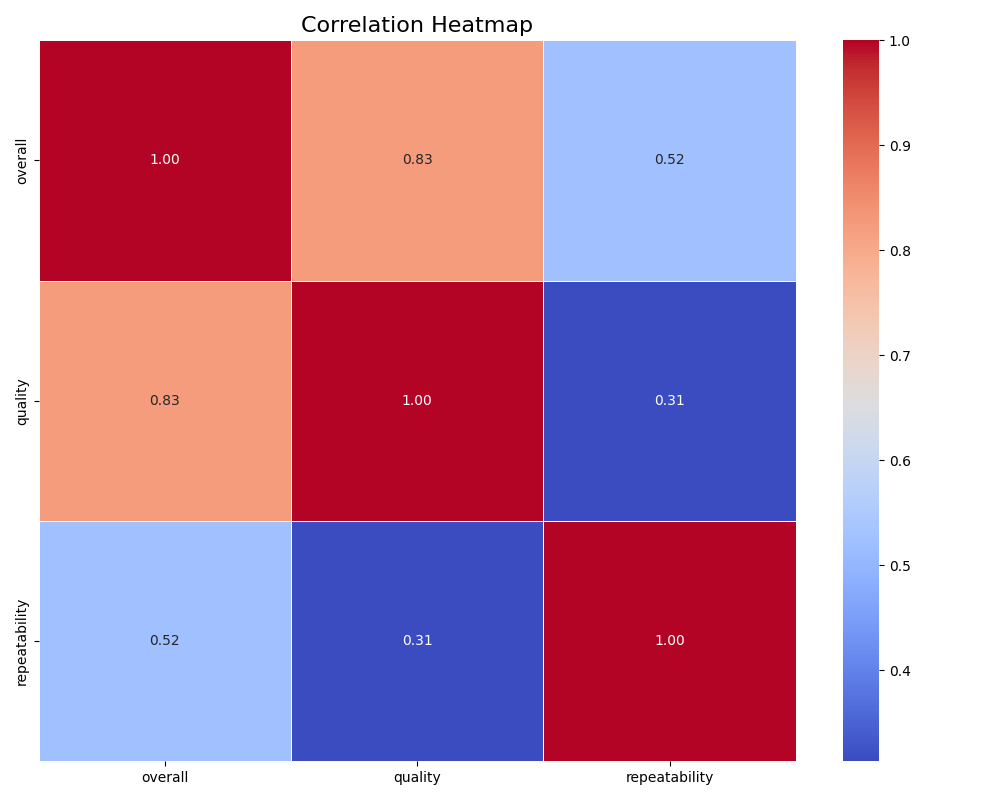
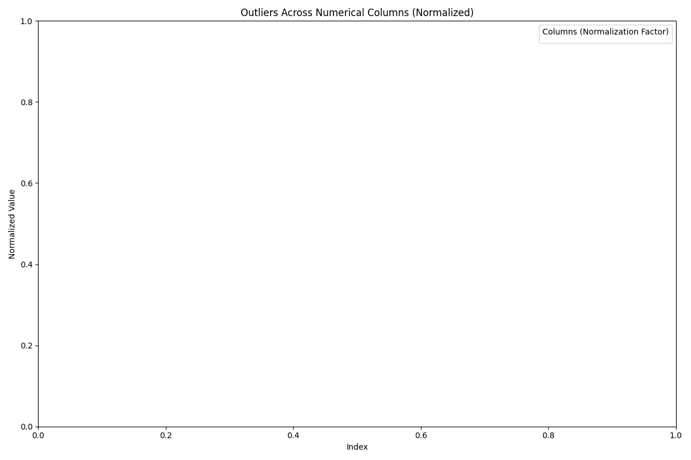
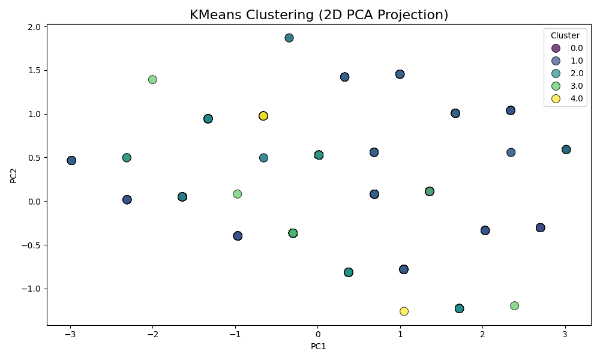
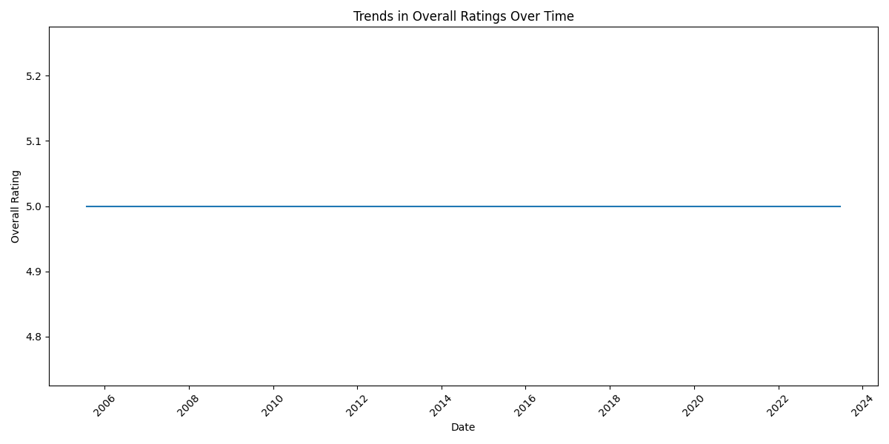

# Analysis of Quality Ratings in User-Generated Content
## Introduction
This dataset comprises 2652 entries, focusing on user-generated content evaluations characterized by ratings of overall quality, specific quality aspects, and repeatability. The attributes include numerical ratings along with categorical information such as language, content type, titles, and authors. The evaluations are likely accumulated over time, as indicated by the 'date' column.
## Metadata

|Name  |Type  |Description  |
|------|------|-------------|
| date | datetime | The release date of the movie |
| language | string | The language of the movie |
| type | string | Type of content (e.g., movie, show) |
| title | string | Title of the movie |
| by | string | Actors or creators associated with the movie |
| overall | integer | Overall rating of the movie |
| quality | integer | Quality rating of the movie |
| repeatability | integer | Indicates if the movie is worth watching again (1 for yes, 2 for no) |
## Descriptive Statistics
| Column | Count | Mean | Std | Min | 25% | 50% | 75% | Max | Null | Invalid |
|--------|-------|------|-----|-----|-----|-----|-----|-----|------|---------|
| overall | 2652.00 | 3.05 | 0.76 | 1.00 | 3.00 | 3.00 | 3.00 | 5.00 |0.00 |0.00 |
| quality | 2652.00 | 3.21 | 0.80 | 1.00 | 3.00 | 3.00 | 4.00 | 5.00 |0.00 |0.00 |
| repeatability | 2652.00 | 1.49 | 0.60 | 1.00 | 1.00 | 1.00 | 2.00 | 3.00 |0.00 |0.00 |

The overall rating has an average of approximately 3.05, suggesting a generally average user satisfaction, with a majority of entries clustering around the lower range of ratings. The quality aspect, with an average of 3.21, shows a slightly more favorable outlook. The repeatability rating, however, indicates that most users rated it as low, with a mean of about 1.49. There are notable trends where ratings tend to cluster around the 1 to 3 range, indicating potential skewness towards lower evaluations, especially for repeatability. No null or invalid entries are recorded, ensuring data reliability.
## Preprocessing
Rows dropped: 361

Below are count of values ignored due to out of range
|Column  |Count  |
|------|------|
| overall | 0 |
| quality | 0 |
| repeatability | 0 |

### Correlation 

Below is the correlation heatmap

The correlation analysis revealed a strong relationship between the 'overall' rating and 'quality'. This suggests that as the quality rating improves, so does the overall assessment from the respondents, highlighting the importance of perceived quality in driving overall satisfaction.

### Outlier Detection 

Below are the outlier details
|Column  |(Min,Max) |
|------|------|
| overall | None |
| quality | None |
| repeatability | None |

The analysis for outliers showed no significant anomalies in the 'overall', 'quality', or 'repeatability' scores. This indicates that the data's distribution is normal and robust, supporting the validity of the insights drawn from the dataset.

### K-Means Cluster 

Below are the cluster details
|Cluster  |Count  |
|------|------|
| 2 | 1072 |
| 1 | 655 |
| 0 | 372 |
| 3 | 188 |
| 4 | 88 |

The cluster analysis categorized the dataset into 5 distinct groups. Cluster 2 contained the highest number of entries (1072), suggesting it represents the most common type of observation. Clusters 1 to 4 varied in size, with Cluster 1 capturing 655 entries, Cluster 0 with 372 entries, and Clusters 3 and 4 having 188 and 88 entries respectively. This clustering may reveal varying perspectives among respondents.

### Trends in Overall Ratings Over Time 

Below is the analysis

The trends may indicate fluctuations in user satisfaction or performance, which could be due to various factors such as changes in product features, customer service quality, or market conditions.

To improve ratings, consider conducting surveys to gather user feedback, analyze the reasons behind the fluctuations, and implement targeted improvements based on the findings.

## Summary

Overall, the analysis of the dataset offers insightful conclusions about consumer perceptions based on their ratings. The correlation between overall satisfaction and quality is a crucial finding, implying that improving quality can enhance overall customer satisfaction. Given that the majority of the dataset falls into Cluster 2, guidance can be directed towards further investigating the attributes of this cluster, as it may represent the typical user experience. It is recommended that future strategies focus on enhancing quality to lift overall ratings and investigating the characteristics of different clusters to cater to diverse consumer needs.
