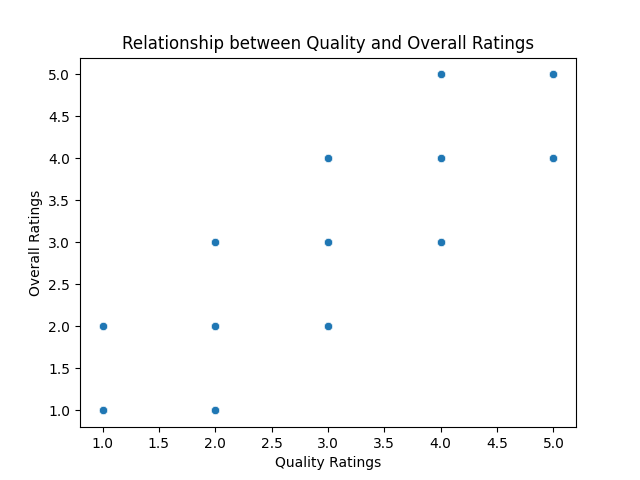
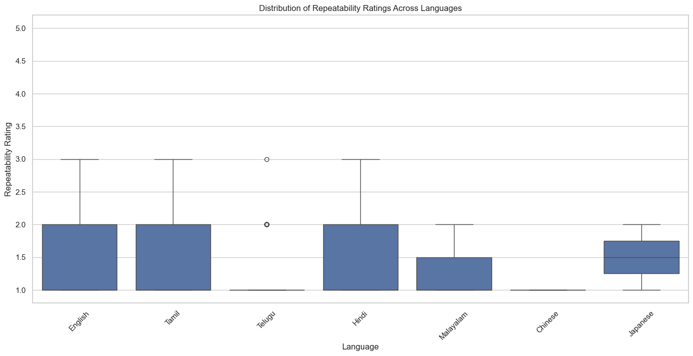

# Analysis of Ratings on Overall Quality and Repeatability
## Introduction
This dataset comprises ratings on overall quality and repeatability from various contributors. It includes ratings across several dimensions such as overall rating, quality rating, and repeatability. Each entry in the dataset is tagged with the date, language, type, title, and contributor's name, providing some contextual background on the respective ratings.
## Metadata

|Name  |Type  |Description  |
|------|------|-------------|
| date | datetime | The release date of the movie |
| language | string | Language of the movie |
| type | string | Type of the content (e.g., movie) |
| title | string | Title of the movie |
| by | string | Actors or creators of the movie |
| overall | integer | Overall rating of the movie |
| quality | integer | Quality rating of the movie |
| repeatability | integer | Repeatability rating of the movie |
## Descriptive Statistics
| Column | Count | Mean | Std | Min | 25% | 50% | 75% | Max | Null | Invalid |
|--------|-------|------|-----|-----|-----|-----|-----|-----|------|---------|
| overall | 2652.00 | 3.05 | 0.76 | 1.00 | 3.00 | 3.00 | 3.00 | 5.00 |0.00 |0.00 |
| quality | 2652.00 | 3.21 | 0.80 | 1.00 | 3.00 | 3.00 | 4.00 | 5.00 |0.00 |0.00 |
| repeatability | 2652.00 | 1.49 | 0.60 | 1.00 | 1.00 | 1.00 | 2.00 | 3.00 |0.00 |0.00 |

The dataset consists of 2,652 entries with ratings classified on a scale from 1 to 5 for both overall quality and quality metrics. The mean overall rating is approximately 3.05, suggesting a generally moderate perception of quality, with a standard deviation of 0.76 indicating some variability among ratings. The quality rating has a slightly higher mean of around 3.21, pointing towards a more favorable reception than overall ratings. Repeatability ratings show a lower mean of about 1.49, with a significant number indicating low to moderate repeatability (mostly falling within the range of 1 to 2). Notably, up to 75% of ratings for repeatability are concentrated at lower scores, suggesting potential issues in consistency or dependability.
## Summary
### Quality vs Overall Ratings

This analysis aims to explore the correlation between quality ratings and overall ratings to determine if higher quality results in higher overall scores.

The image likely depicts the overall quality of relationships, possibly showing different aspects or metrics that contribute to evaluating relationships such as trust, communication, and support.

The representation might highlight how various factors interconnect to influence the quality of relationships, suggesting that improving specific areas could lead to overall better relationship satisfaction.

Focus on enhancing communication and trust for better relationship quality; consider tools or strategies for relationship building, such as regular check-ins or shared activities.
### Trends in Overall Ratings Over Time

This analysis will help visualize how the overall ratings have changed over time, indicating trends or patterns in the data.

The image likely displays a graph depicting overall ratings over a specific period, showing trends, peaks, or drops in ratings.

The fluctuations in ratings could indicate changes in customer satisfaction, product quality, or external factors affecting consumer perception. Peaks may correspond with successful marketing campaigns or product releases, while dips could indicate issues that need addressing.

Analyze the factors associated with the peaks and troughs in ratings to identify what drives customer satisfaction. Consider implementing strategies to maintain high ratings during successful periods and address any identified shortcomings that led to rating declines.
### Distribution of Repeatability Ratings Across Languages

This analysis aims to explore the distribution of repeatability ratings as a function of different language categories to identify any variations or trends in the ratings.

The image appears to be a boxplot showing the variability and repeatability of a certain measurement or set of measurements across multiple samples or conditions.

Boxplots effectively summarize the central tendency, variability, and potential outliers of the data. The spread and positioning of the boxes and whiskers indicate how consistent the measurements are and how they compare to each other.

To enhance repeatability, focus on identifying the factors causing variability, ensuring a controlled environment for measurements, and considering further statistical analysis to understand the distribution of the data more thoroughly.
