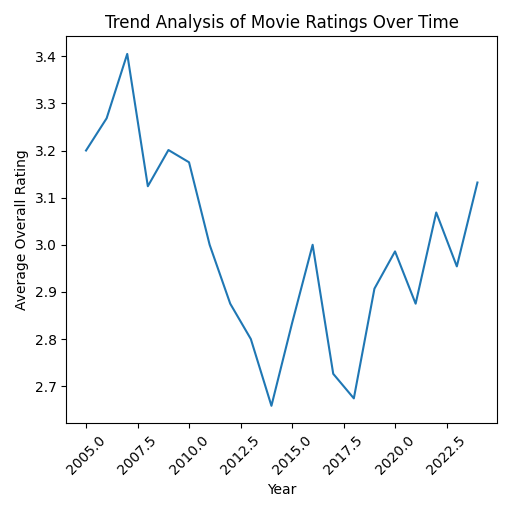
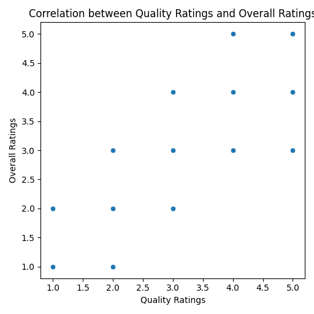
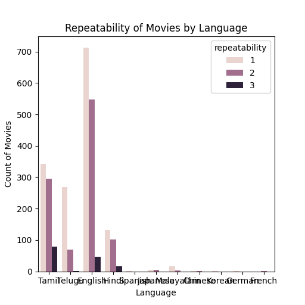

# Analysis of Movie Ratings and Attributes
## Introduction
This dataset encompasses various attributes of movies, providing insights into their ratings, release dates, languages, and associated individuals (like actors). It aims to explore how these factors contribute to the perception of a movie's quality and overall enjoyment. Key attributes include date of release, language, type of content, movie title, cast, and detailed ratings categorized into overall rating, quality rating, and repeatability indicator.
## Metadata

|Name  |Type  |Description  |
|------|------|-------------|
| date | datetime | The release date of the movie |
| language | string | The language in which the movie is made |
| type | string | The type of the content, typically movie |
| title | string | The title of the movie |
| by | string | The names of the individuals associated with the movie, such as actors |
| overall | integer | Overall rating of the movie |
| quality | integer | Quality rating of the movie |
| repeatability | integer | Indicates if the movie is repeatable (1 for Yes, 2 for No) |
## Descriptive Statistics
| Column | Count | Mean | Std | Min | 25% | 50% | 75% | Max |
|--------|-------|------|-----|-----|-----|-----|-----|-----|
| overall | 2652.00 | 3.05 | 0.76 | 1.00 | 3.00 | 3.00 | 3.00 | 5.00 |
| quality | 2652.00 | 3.21 | 0.80 | 1.00 | 3.00 | 3.00 | 4.00 | 5.00 |
| repeatability | 2652.00 | 1.49 | 0.60 | 1.00 | 1.00 | 1.00 | 2.00 | 3.00 |

The movie dataset reveals diverse trends. The overall ratings range significantly, indicating a varied reception of movies. The quality ratings also provide insight into perceived production values, while the repeatability indicator highlights viewer engagement and satisfaction. Outliers in ratings may signify critically acclaimed films or those that were poorly received, warranting further investigation.
## Analysis

### Observation 1
The graph depicts the trend of average overall movie ratings over time, spanning from 2005 to 2025. The data shows fluctuations in ratings, with a noticeable peak around 2007, followed by a decline until around 2014, after which the ratings start to increase again, particularly in the last couple of years, indicating a possible resurgence in movie quality or audience satisfaction.The overall trend analysis suggests that while movie ratings fluctuated significantly between 2005 and 2025, there is a potential upward trend in the most recent years, indicating a possible improvement in the quality of movies or shifts in audience preferences.

### Observation 2
The scatter plot illustrates the correlation between two variables: Quality Ratings and Overall Ratings. Each point represents an observation where higher Quality Ratings do not consistently correlate with higher Overall Ratings; instead, there seems to be a loose relationship without a clear trend. This suggests that while there may be some alignment, other factors might also be influencing Overall Ratings significantly.The plot indicates a weak correlation between Quality Ratings and Overall Ratings, suggesting that the two ratings may not directly influence one another.

### Observation 3
The chart presents data on the repeatability of movies categorized by language, displaying the count of movies for each repeatability level. It shows a clear predominance of movies in English and Tamil with higher counts, indicating that these languages have a larger production of repeatable movies compared to others such as German or French, which have significantly lower counts. The usage of different shades likely represents varying levels of repeatability.The chart indicates that English and Tamil are the most prolific languages in producing repeatable movies, while other languages like German and French have less representation.

