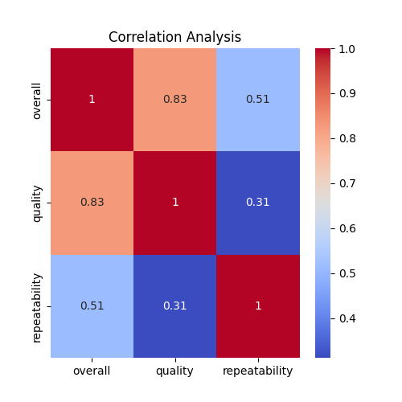
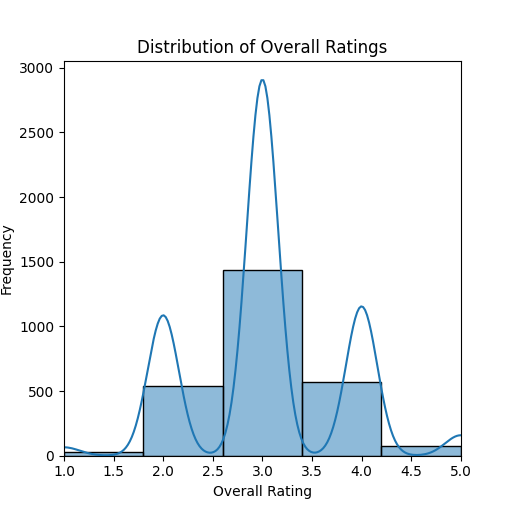

# Movie Ratings Analysis
## Introduction
This dataset provides an overview of movie releases, capturing details such as release date, language, type, title, the actors involved, and ratings. The dataset focuses particularly on three key ratings: overall, quality, and repeatability, each assessed on a scale from 1 to 5. This comprehensive collection allows for insights regarding audience reception and content quality across various films.
## Metadata

|Name  |Type  |Description  |
|------|------|-------------|
| date | datetime | The release date of the movie in DD-MMM-YY format |
| language | string | The language of the movie |
| type | string | The type of the content (e.g., movie) |
| title | string | The title of the movie |
| by | string | The actors involved in the movie, separated by commas |
| overall | integer | Overall rating of the movie on a scale (1-5) |
| quality | integer | Quality rating of the movie on a scale (1-5) |
| repeatability | integer | Repeatability rating of the movie on a scale (1-5) |
## Descriptive Statistics
| Column | Count | Mean | Std | Min | 25% | 50% | 75% | Max |
|--------|-------|------|-----|-----|-----|-----|-----|-----|
| overall | 2652.00 | 3.05 | 0.76 | 1.00 | 3.00 | 3.00 | 3.00 | 5.00 |
| quality | 2652.00 | 3.21 | 0.80 | 1.00 | 3.00 | 3.00 | 4.00 | 5.00 |
| repeatability | 2652.00 | 1.49 | 0.60 | 1.00 | 1.00 | 1.00 | 2.00 | 3.00 |

The descriptive statistics reveal that the overall ratings, quality ratings, and repeatability ratings are all measured on a 1-5 scale. Patterns may emerge indicating trends in viewer preferences, with potential outliers that could signify exceptional or poor reception. Notably, the presence of actors and their correlation with movie ratings could also suggest trends in audience appeal related to specific cast members.
## Analysis

### Observation 1
The image presents a correlation matrix showing the relationship between three variables: overall, quality, and repeatability. The values range from 0 to 1, where 1 indicates a perfect positive correlation, and values close to 0 indicate little or no correlation. The colors enhance readability, with darker shades signifying stronger correlations. Overall and quality show a strong positive correlation (0.83), while repeatability has a lower correlation with the other two variables, especially with quality (0.31). This suggests that while overall performance is closely linked to quality, the relationship with repeatability is weaker. This analysis can help in understanding how these variables interact and influence each other, which is vital in fields like manufacturing or quality control.The correlation matrix indicates that 'overall' and 'quality' are strongly correlated, while 'repeatability' shows a weaker correlation with both 'overall' and 'quality'.

### Observation 2
The image displays a histogram with a smooth density plot overlay, showing the distribution of overall ratings. It has three prominent peaks, suggesting that ratings tend to cluster around certain values (specifically 2.5, 3.5, and 4.5). The frequency increases significantly around these values, indicating they are popular ratings. The lower frequencies at the extremes (1.0 and 5.0) hint that extreme ratings are less common. Overall, the shape of the distribution is somewhat bimodal with a central tendency towards mid-level ratings.The distribution of overall ratings exhibits peaks around 2.5, 3.5, and 4.5, indicating that these ratings are more frequently assigned compared to lower (1.0) and higher (5.0) ends. This suggests a preference for moderate to high ratings among the respondents.

